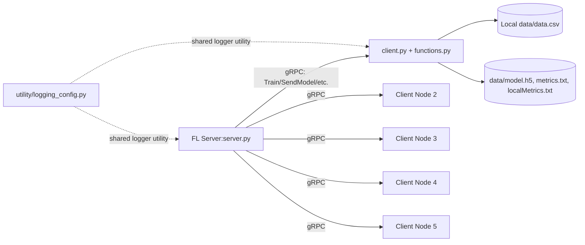
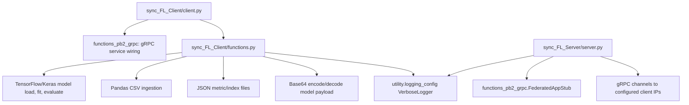
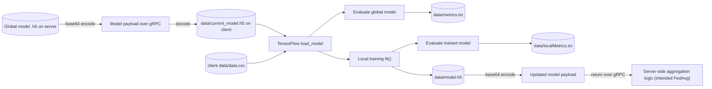

# FEDIL-Sync: A Federated learning framework for neural network training

The framework is designed to train a neural network task on various fog nodes. The fog nodes consist of resources constrained devices such as Raspberry Pi.

The standard federated learning paradigm with fedAvg implementation is done on continuously generating datasets. 

Firstly, the server starts training by initializing the model and asking connected nodes to train the model on their local datasets. The server waits for participating clients to return the model, thereafter it aggregates the updates. The training continues till the global model converges or the expected model is created. 

## Structure and prerequisite

The project contains code for the client and server that need to be run on respective devices. The clients are resource-constrained devices such as Raspberry Pi, and a server can be computers/laptops.  

All participating nodes should have docker installed so that appropriate images can be downloaded. Otherwise, the user has to create a docker image with the code given in the project. 

To connect to the client, the server need to have access to ip address of the participating clients. 

Additionally, every client should have data in the data folder that will be used for training. 

# How to run the code

## On the server side
1. Run requirement.txt
2. Edit/create appropriate channels for available clients with respective ip addresses in server.py
3. Define neural network in the createInitialModel() function.
4. Run server.py


## On the client side 

### To run directly on the client 
1. Check/change docker image in docker-compose.yaml file
2. Run docker-compose.yaml

The compose will download and execute images on the fog device.  


### To create a new image

In case of a given image is not working, then the image can be created with docker-compose.yaml file. 

Edit compose file on the image tag with build code. Then run docker-compose.yaml.
```
build:
    context: .
    dockerfile: Dockerfile
```


The program is still menu driven. To start the execution, you need to hit start from the server end. In the current form, press 7, which will execute n(60) rounds of federated learning. 


## Result  and report

The server will have evaluation results(accuracy, loss) and latest global model in Models folder.  

Similarly, every client will have locally trained results and latest model in the data folder. 

###########################################################
###########################################################
## Main Entry Points and Runtime Behaviour
- **Server entry point:** `sync_FL_Server/server.py`
  - Initializes verbose logging.
  - Creates gRPC channels/stubs to a fixed set of client IP addresses.
  - Provides utility logic such as model file encoding for transmission.
- **Client entry point:** `sync_FL_Client/client.py`
  - Starts a gRPC server on `0.0.0.0:8080`.
  - Registers RPC handlers that delegate to `sync_FL_Client/functions.py`.
- **Client training core:** `sync_FL_Client/functions.py`
  - Receives a base64 model payload.
  - Decodes + loads model.
  - Loads local CSV data, evaluates, trains, re-evaluates.
  - Saves metrics and model artifacts.
  - Returns base64-encoded updated model.

## Architecture diagrams
### A. Top-level architecture diagram

### B. Mid-level module interaction diagram


### C. Function-level breakdown (critical components)
- `Train(modelString)` in `sync_FL_Client/functions.py`
  1. Decode incoming model (`base64.b64decode`).
  2. Persist to `data/current_model.h5` and load via `load_model`.
  3. Prepare local training data from `data/data.csv` (batch mode default).
  4. Evaluate global model and append metrics to `data/metrics.txt`.
  5. Train local model (`fit`, batch_size=32, epochs=16).
  6. Evaluate trained model and append metrics to `data/localMetrics.txt`.
  7. Save trained model to `data/model.h5`.
  8. Encode saved model and return payload string.
- `InitializeClient()`
  - Creates/initializes `indexFile.txt`, `metrics.txt`, `localMetrics.txt`.
- `saveLearntMetrics(file_name, score)`
  - Appends loss/accuracy values into JSON metric files.
- `encode_file(file_name)` in server
  - Reads model under `Models/` and base64-encodes it for transport.

## 4) Data flow diagram

